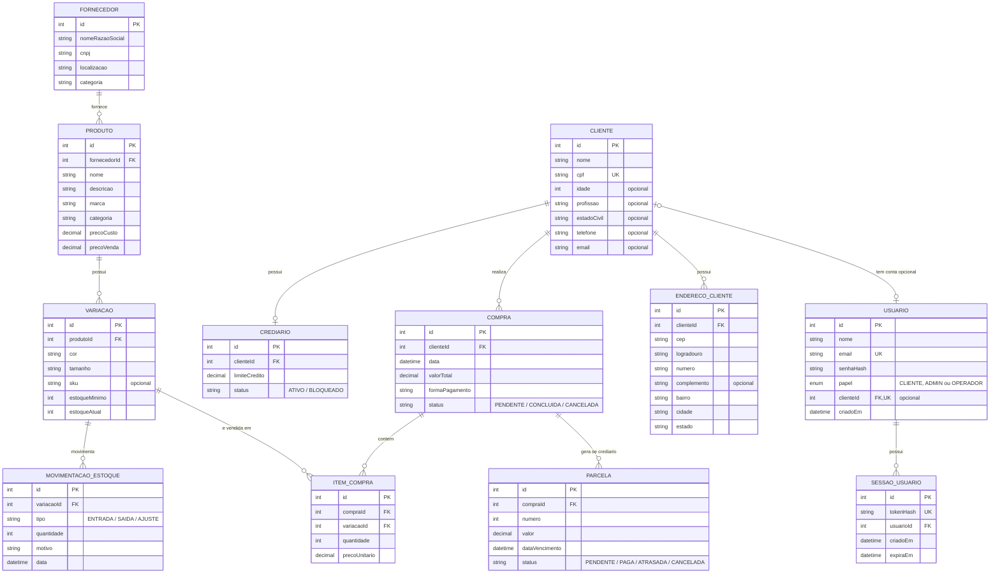

# Banco de dados

PostgreSQL, modelado via Prisma. O schema completo (fonte da verdade) está em `backend/prisma/schema.prisma` — este documento explica o modelo em português e destaca o que mudou em relação ao diagrama ER original que a equipe desenhou.

## Diagrama de relações

`Usuario` guarda as credenciais e tem um vínculo opcional e único com `Cliente`. Contas públicas são criadas com papel `CLIENTE` e vínculo obrigatório pela API; o schema permite clientes sem conta e usuários internos sem cliente. `SessaoUsuario` mantém as sessões de acesso da loja (ver seções abaixo).

- **Fornecedor → Produto**: 1:N. Um produto pertence a um único fornecedor.
- **Produto → Variação**: 1:N. Cada combinação de cor/tamanho de um produto é uma variação própria, com seu próprio estoque e SKU.
- **Variação → MovimentacaoEstoque**: 1:N. Toda entrada, saída ou ajuste de estoque fica registrado por variação.
- **Variação → ItemCompra**: 1:N. Uma variação pode aparecer em vários itens de compra ao longo do tempo.
- **Cliente → Crediario**: 1:0..1 no banco, com `Crediario.clienteId` único. O cadastro pela API cria um crediário automaticamente; clientes antigos podem continuar sem ele.
- **Cliente → Compra**: 1:N.
- **Cliente → EnderecoCliente**: 1:N. Um cliente pode ter zero ou mais endereços de entrega; cada endereço pertence a um único cliente.
- **Compra → ItemCompra**: 1:N (os itens da compra).
- **Compra → Parcela**: 1:N, só populado quando a forma de pagamento é crediário.

## Entidades

### Fornecedor
| Campo | Tipo | Observação |
|---|---|---|
| id | Int (PK) | |
| nomeRazaoSocial | String | |
| cnpj | String | único |
| localizacao | String? | |
| categoria | String? | |

### Produto
| Campo | Tipo | Observação |
|---|---|---|
| id | Int (PK) | |
| fornecedorId | Int (FK) | |
| nome | String | |
| descricao | String? | |
| marca | String? | |
| categoria | String? | usado nos filtros do painel (Feminino/Masculino/Infantil/Acessórios) |
| precoCusto | Decimal(10,2) | |
| precoVenda | Decimal(10,2) | |
| criadoEm | DateTime | default now(); ordena o catálogo e identifica novidades |

### Variação
| Campo | Tipo | Observação |
|---|---|---|
| id | Int (PK) | |
| produtoId | Int (FK) | |
| cor | String? | |
| tamanho | String? | |
| sku | String? | único, **opcional** (nem toda loja física tem SKU pra tudo) |
| estoqueMinimo | Int | default 0 — **não estava no diagrama original** |
| estoqueAtual | Int | default 0 — **não estava no diagrama original** |

`estoqueMinimo`/`estoqueAtual` foram adicionados porque a tela de Estoque precisa saber a quantidade em tempo real (sem recalcular somando todo o histórico a cada consulta) e o limiar pra disparar o alerta "estoque baixo". `estoqueAtual` é mantido em sincronia com `MovimentacaoEstoque` dentro da mesma transação sempre que uma movimentação é criada (ver [ARQUITETURA.md](./ARQUITETURA.md)).

### MovimentacaoEstoque
| Campo | Tipo | Observação |
|---|---|---|
| id | Int (PK) | |
| variacaoId | Int (FK) | |
| tipo | Enum: `ENTRADA` \| `SAIDA` \| `AJUSTE` | `AJUSTE` **não estava no diagrama original** |
| quantidade | Int | |
| motivo | String? | **não estava no diagrama original** (ex.: "Chegada de mercadoria", "Venda #12") |
| data | DateTime | default now() |

### Cliente

| Campo | Tipo | Observação |
|---|---|---|
| id | Int (PK) | autoincremento |
| nome | String | obrigatório; a API remove espaços nas extremidades e aceita até 150 caracteres |
| cpf | String | único; a API valida os dígitos verificadores e salva os 11 dígitos sem máscara |
| idade | Int? | opcional; a API aceita inteiro de 0 a 130 ou `null` |
| profissao | String? | opcional; texto livre de até 150 caracteres na API |
| estadoCivil | String? | opcional; texto livre de até 150 caracteres na API |
| telefone | String? | opcional; a API salva DDD e número, com 10 ou 11 dígitos, sem máscara nem prefixo `+55` |
| email | String? | opcional e não único; a API valida o formato, aceita até 254 caracteres e salva em minúsculas |

As regras de formato, tamanho e faixa acima são aplicadas pela API. O banco garante os tipos, a nulabilidade, a chave primária e a unicidade de `cpf`. Cadastros antigos com CPF mascarado continuam sendo reconhecidos nas verificações de duplicidade; a migração de e-mail e endereços não reescreve esses CPFs.

As relações no Prisma são `usuario: Usuario?`, `crediario: Crediario?`, `compras: Compra[]` e `enderecos: EnderecoCliente[]`. `POST /clientes` cria cliente, endereços opcionais e crediário em uma única operação atômica. `POST /auth/cadastro` cria o mesmo conjunto junto ao usuário com credenciais. O crediário inicia com status `ATIVO` e os campos `limiteCredito` e `limiteDisponivel` iguais ao valor de `EXPOSICAO_CREDITO_CREDIARIO`, usando zero quando a variável está ausente. Essa criação é feita pela API; a relação opcional no schema permite manter clientes antigos sem crediário.

`PUT /clientes/:id` preserva os campos omitidos e não altera credenciais, compras nem crediário. Na exclusão, a API rejeita conta de usuário vinculada, parcelas em aberto e qualquer compra registrada, mesmo quitada ou cancelada, retornando `409`. Sem esses vínculos, a presença de crediário não impede a exclusão: a API remove esse registro e o cliente na mesma transação, e os endereços são removidos em cascata. A resposta é `204`, inclusive para clientes novos com crediário automático. A remoção do crediário é explícita na API, não uma cascata dessa relação; as chaves estrangeiras continuam protegendo vínculos concorrentes, e uma falha desfaz a transação.

### EnderecoCliente

Endereços de entrega vinculados ao cadastro, adicionados junto com o e-mail para atender ao escopo de clientes.

| Campo | Tipo | Observação |
|---|---|---|
| id | Int (PK) | autoincremento |
| clienteId | Int (FK) | obrigatório; referencia `Cliente.id` e possui índice não único |
| cep | String | obrigatório; a API aceita máscara e salva 8 dígitos |
| logradouro | String | obrigatório; até 150 caracteres na API |
| numero | String | obrigatório; até 20 caracteres na API, permitindo valores como `s/n` |
| complemento | String? | opcional; até 150 caracteres na API |
| bairro | String | obrigatório; até 150 caracteres na API |
| cidade | String | obrigatório; até 150 caracteres na API |
| estado | String | obrigatório; a API valida a UF brasileira e salva em maiúsculas |

A chave estrangeira usa `ON DELETE CASCADE` e `ON UPDATE CASCADE`. O índice `EnderecoCliente_clienteId_idx` atende às consultas de endereços por cliente. Nas rotas de edição e exclusão, a API confere `id` e `clienteId` juntos, impedindo alterar ou remover o endereço de outro cliente. O corpo da requisição não permite transferir um endereço para outro cadastro.

O cadastro inicial aceita até 20 endereços na mesma requisição; esse limite pertence à validação do `POST /clientes`, não é uma restrição de quantidade total no banco. Endereços também podem ser adicionados individualmente em `/clientes/:id/enderecos`. Veja os contratos em [CLIENTES.md](./CLIENTES.md).

### Crediario
| Campo | Tipo | Observação |
|---|---|---|
| id | Int (PK) | |
| clienteId | Int (FK, único) | garante o 1:1 com Cliente |
| limiteCredito | Decimal(10,2) | |
| status | Enum: `ATIVO` \| `BLOQUEADO` | default `ATIVO` |

### Compra
| Campo | Tipo | Observação |
|---|---|---|
| id | Int (PK) | |
| clienteId | Int (FK) | |
| data | DateTime | default now() |
| valorTotal | Decimal(10,2) | |
| formaPagamento | String | texto livre (ex.: "à vista", "cartão", "crediário") |
| status | Enum: `PENDENTE` \| `CONCLUIDA` \| `CANCELADA` | default `PENDENTE` |

### ItemCompra
| Campo | Tipo | Observação |
|---|---|---|
| id | Int (PK) | |
| compraId | Int (FK) | |
| variacaoId | Int (FK) | |
| quantidade | Int | |
| precoUnitario | Decimal(10,2) | preço no momento da venda (não referencia `Produto.precoVenda` diretamente, pra manter histórico correto mesmo se o preço mudar depois) |

### Parcela
| Campo | Tipo | Observação |
|---|---|---|
| id | Int (PK) | |
| compraId | Int (FK) | |
| numero | Int | número da parcela (1, 2, 3...) |
| valor | Decimal(10,2) | |
| dataVencimento | DateTime | |
| status | Enum: `PENDENTE` \| `PAGA` \| `ATRASADA` \| `CANCELADA` | default `PENDENTE`; canceladas não compõem os débitos do cliente |

### Usuario 
| Campo | Tipo | Observação |
|---|---|---|
| id | Int (PK) | |
| nome | String | |
| email | String | único |
| senhaHash | String | scrypt com salt aleatório; senha original não é armazenada |
| papel | Enum: `ADMIN` \| `OPERADOR` \| `CLIENTE` | default `CLIENTE`; cadastro público fixa esse papel |
| clienteId | Int (FK, único) | opcional; referencia `Cliente.id`, com `ON DELETE RESTRICT` |
| criadoEm | DateTime | default now() |

O cadastro e o login da loja usam essa tabela. O usuário recebe as credenciais e é criado junto ao cliente; CPF, contato e relações comerciais ficam em `Cliente`. Nome e e-mail são preenchidos nas duas tabelas inicialmente para manter o contrato administrativo. Alterações de contato pelo painel não alteram o e-mail de acesso. Usuários e clientes antigos são preservados sem vínculo automático. O login administrativo ainda não usa a tabela (ver [ARQUITETURA.md](./ARQUITETURA.md)).

### SessaoUsuario

| Campo | Tipo | Observação |
| --- | --- | --- |
| id | Int (PK) | autoincremento |
| tokenHash | String (único) | SHA-256 do token aleatório; token original fica somente no cookie |
| usuarioId | Int (FK, índice) | referencia `Usuario.id`, com `ON DELETE CASCADE` |
| criadoEm | DateTime | default now() |
| expiraEm | DateTime (índice) | sete dias após o login |

A sessão é validada em `/auth/me`, revogada no logout e substituída quando o mesmo navegador faz outro login. O cookie é HttpOnly, SameSite=Lax e Secure em produção. Contratos e regras em [CONTAS.md](./CONTAS.md).

## O que mudou em relação ao diagrama ER original da equipe

| Mudança | Motivo |
|---|---|
| Tabela `Usuario` adicionada | Credenciais de acesso; agora usada nas contas de clientes da loja |
| `Usuario.clienteId` único e papel `CLIENTE` | Vinculam a conta aos dados comerciais sem converter usuários internos ou clientes antigos |
| Tabela `SessaoUsuario` adicionada | Mantém sessões revogáveis no servidor, com apenas o hash do token |
| `Variacao.sku` virou opcional (era obrigatório) | Nem toda variação cadastrada na loja física tem SKU definido ainda |
| `Variacao.estoqueMinimo` e `estoqueAtual` adicionados | Necessários pro alerta de estoque baixo/esgotado na tela de Estoque |
| `MovimentacaoEstoque.motivo` adicionado | Descrever a movimentação (chegada de mercadoria, venda, ajuste de inventário) |
| `TipoMovimentacaoEstoque` ganhou o valor `AJUSTE` | Além de entrada/saída, precisava de um tipo pra correções manuais (perda, inventário) |
| `Cliente.email` adicionado como opcional | Complementa o contato do cliente previsto no escopo, preservando cadastros existentes |
| Tabela `EnderecoCliente` adicionada | Permite múltiplos endereços de entrega por cliente, com exclusão em cascata quando o cadastro pode ser removido |
| Relação `Cliente → Crediario` opcional no schema | Mantém clientes antigos sem crediário; novos cadastros pela API criam o crediário automaticamente |

## Migrations

Histórico em `backend/prisma/migrations/`:

1. **`20260814021309_init`** — schema inicial, traduzido direto do diagrama ER da equipe (todas as tabelas originais + `Usuario`).
2. **`20260825014834_estoque_minimo_atual_motivo`** — adiciona `estoqueMinimo`/`estoqueAtual` em Variação, `motivo` em MovimentacaoEstoque, e o tipo `AJUSTE`.
3. **`20260825021818_sku_opcional`** — torna `Variacao.sku` opcional.
4. Para o cadastro de clientes, a migração **`20260907143000_clientes_email_enderecos`** adiciona `Cliente.email` como coluna opcional e cria `EnderecoCliente`, com índice em `clienteId` e chave estrangeira em cascata. Os clientes existentes são preservados, inicialmente com e-mail nulo e sem endereços; essa migração não cria crediários para eles. O cadastro integrado também depende das migrations do módulo de crediário que constam no diretório, incluindo a que adiciona `limiteDisponivel`.
5. Para contas de clientes, **`20260908200000_papel_cliente`** acrescenta o valor `CLIENTE` ao enum em uma migração separada, antes de usá-lo como padrão. **`20260908200100_usuario_cliente_sessao`** acrescenta o vínculo opcional e único, define o novo papel padrão e cria as sessões. Nenhum cliente ou usuário existente é apagado ou associado automaticamente.

Para aplicar as migrations existentes: `npx prisma migrate deploy` e `npx prisma generate` (ver `README.md` na raiz). Para alterar o schema, editar `schema.prisma` e rodar `npx prisma migrate dev --name <descricao>` em desenvolvimento.
