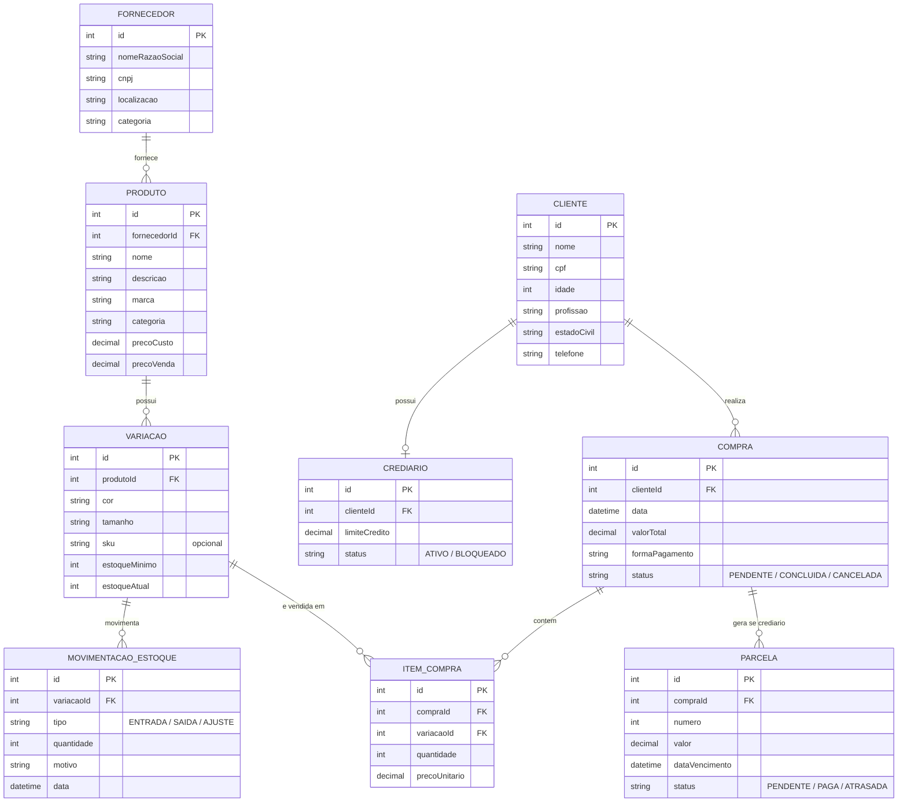

# Banco de dados

PostgreSQL, modelado via Prisma. O schema completo (fonte da verdade) está em `backend/prisma/schema.prisma` — este documento explica o modelo em português e destaca o que mudou em relação ao diagrama ER original que a equipe desenhou.

## Diagrama de relações

A tabela `Usuario` (autenticação do painel) fica de fora do diagrama acima de propósito — ela não se relaciona com o domínio da loja, é só suporte pro login administrativo (ver seção abaixo).

- **Fornecedor → Produto**: 1:N. Um produto pertence a um único fornecedor.
- **Produto → Variação**: 1:N. Cada combinação de cor/tamanho de um produto é uma variação própria, com seu próprio estoque e SKU.
- **Variação → MovimentacaoEstoque**: 1:N. Toda entrada, saída ou ajuste de estoque fica registrado por variação.
- **Variação → ItemCompra**: 1:N. Uma variação pode aparecer em vários itens de compra ao longo do tempo.
- **Cliente → Crediario**: 1:1. Cada cliente tem no máximo um crediário.
- **Cliente → Compra**: 1:N.
- **Compra → ItemCompra**: 1:N (os itens da compra).
- **Compra → Parcela**: 1:N, só populado quando a forma de pagamento é crediário.

## Entidades

### Fornecedor
| Campo | Tipo | Observação |
|---|---|---|
| id | Int (PK) | |
| nomeRazaoSocial | String | |
| cnpj | String | único |
| localizacao | String? | |
| categoria | String? | |

### Produto
| Campo | Tipo | Observação |
|---|---|---|
| id | Int (PK) | |
| fornecedorId | Int (FK) | |
| nome | String | |
| descricao | String? | |
| marca | String? | |
| categoria | String? | usado nos filtros do painel (Feminino/Masculino/Infantil/Acessórios) |
| precoCusto | Decimal(10,2) | |
| precoVenda | Decimal(10,2) | |

### Variação
| Campo | Tipo | Observação |
|---|---|---|
| id | Int (PK) | |
| produtoId | Int (FK) | |
| cor | String? | |
| tamanho | String? | |
| sku | String? | único, **opcional** (nem toda loja física tem SKU pra tudo) |
| estoqueMinimo | Int | default 0 — **não estava no diagrama original** |
| estoqueAtual | Int | default 0 — **não estava no diagrama original** |

`estoqueMinimo`/`estoqueAtual` foram adicionados porque a tela de Estoque precisa saber a quantidade em tempo real (sem recalcular somando todo o histórico a cada consulta) e o limiar pra disparar o alerta "estoque baixo". `estoqueAtual` é mantido em sincronia com `MovimentacaoEstoque` dentro da mesma transação sempre que uma movimentação é criada (ver [ARQUITETURA.md](./ARQUITETURA.md)).

### MovimentacaoEstoque
| Campo | Tipo | Observação |
|---|---|---|
| id | Int (PK) | |
| variacaoId | Int (FK) | |
| tipo | Enum: `ENTRADA` \| `SAIDA` \| `AJUSTE` | `AJUSTE` **não estava no diagrama original** |
| quantidade | Int | |
| motivo | String? | **não estava no diagrama original** (ex.: "Chegada de mercadoria", "Venda #12") |
| data | DateTime | default now() |

### Cliente
| Campo | Tipo | Observação |
|---|---|---|
| id | Int (PK) | |
| nome | String | |
| cpf | String | único |
| idade | Int? | |
| profissao | String? | |
| estadoCivil | String? | |
| telefone | String? | |

### Crediario
| Campo | Tipo | Observação |
|---|---|---|
| id | Int (PK) | |
| clienteId | Int (FK, único) | garante o 1:1 com Cliente |
| limiteCredito | Decimal(10,2) | |
| status | Enum: `ATIVO` \| `BLOQUEADO` | default `ATIVO` |

### Compra
| Campo | Tipo | Observação |
|---|---|---|
| id | Int (PK) | |
| clienteId | Int (FK) | |
| data | DateTime | default now() |
| valorTotal | Decimal(10,2) | |
| formaPagamento | String | texto livre (ex.: "à vista", "cartão", "crediário") |
| status | Enum: `PENDENTE` \| `CONCLUIDA` \| `CANCELADA` | default `PENDENTE` |

### ItemCompra
| Campo | Tipo | Observação |
|---|---|---|
| id | Int (PK) | |
| compraId | Int (FK) | |
| variacaoId | Int (FK) | |
| quantidade | Int | |
| precoUnitario | Decimal(10,2) | preço no momento da venda (não referencia `Produto.precoVenda` diretamente, pra manter histórico correto mesmo se o preço mudar depois) |

### Parcela
| Campo | Tipo | Observação |
|---|---|---|
| id | Int (PK) | |
| compraId | Int (FK) | |
| numero | Int | número da parcela (1, 2, 3...) |
| valor | Decimal(10,2) | |
| dataVencimento | DateTime | |
| status | Enum: `PENDENTE` \| `PAGA` \| `ATRASADA` | default `PENDENTE` |

### Usuario *(fora do diagrama original)*
| Campo | Tipo | Observação |
|---|---|---|
| id | Int (PK) | |
| nome | String | |
| email | String | único |
| senhaHash | String | |
| papel | Enum: `ADMIN` \| `OPERADOR` | default `ADMIN` |
| criadoEm | DateTime | default now() |

Essa tabela não faz parte do domínio da loja (o diagrama ER da equipe modela produto/estoque/cliente/crediário, não usuários internos do sistema). Foi criada porque o painel administrativo precisa de algo pra autenticar contra — hoje ela existe no schema, mas **o login ainda não usa ela de verdade** (ver seção de autenticação em [ARQUITETURA.md](./ARQUITETURA.md)). É o próximo passo óbvio de quem for implementar autenticação real.

## O que mudou em relação ao diagrama ER original da equipe

| Mudança | Motivo |
|---|---|
| Tabela `Usuario` adicionada | Necessária pra login do painel; não existia no domínio original |
| `Variacao.sku` virou opcional (era obrigatório) | Nem toda variação cadastrada na loja física tem SKU definido ainda |
| `Variacao.estoqueMinimo` e `estoqueAtual` adicionados | Necessários pro alerta de estoque baixo/esgotado na tela de Estoque |
| `MovimentacaoEstoque.motivo` adicionado | Descrever a movimentação (chegada de mercadoria, venda, ajuste de inventário) |
| `TipoMovimentacaoEstoque` ganhou o valor `AJUSTE` | Além de entrada/saída, precisava de um tipo pra correções manuais (perda, inventário) |

## Migrations

Histórico em `backend/prisma/migrations/`:

1. **`20260814021309_init`** — schema inicial, traduzido direto do diagrama ER da equipe (todas as tabelas originais + `Usuario`).
2. **`20260825014834_estoque_minimo_atual_motivo`** — adiciona `estoqueMinimo`/`estoqueAtual` em Variação, `motivo` em MovimentacaoEstoque, e o tipo `AJUSTE`.
3. **`20260825021818_sku_opcional`** — torna `Variacao.sku` opcional.

Pra aplicar as migrations num banco novo: `npx prisma migrate dev` (ver `README.md` na raiz). Pra alterar o schema, sempre editar `schema.prisma` e rodar `npx prisma migrate dev --name <descricao>` — nunca alterar o banco diretamente.
