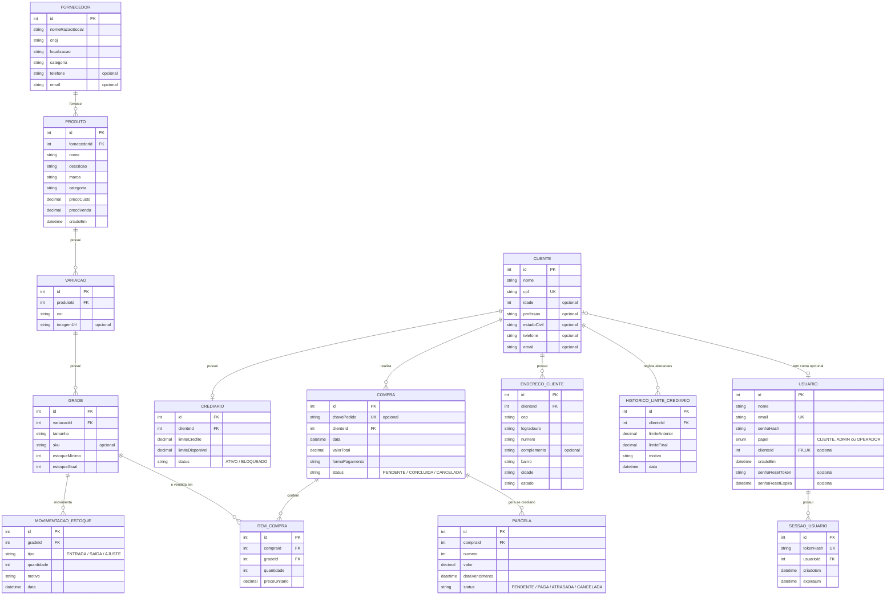

# Banco de dados

PostgreSQL, modelado via Prisma. O schema completo (fonte da verdade) está em `backend/prisma/schema.prisma` — este documento explica o modelo em português e destaca o que mudou em relação ao diagrama ER original que a equipe desenhou.

## Diagrama de relações

`Usuario` guarda as credenciais e tem um vínculo opcional e único com `Cliente` . Contas públicas são criadas com papel `CLIENTE` e vínculo obrigatório pela API; o schema permite clientes sem conta e utilizadores internos sem cliente . `SessaoUsuario` mantém as sessões de acesso da loja .

*   **Fornecedor → Produto**: 1:N. Um produto pertence a um único fornecedor .
*   **Produto → Variação**: 1:N. Uma variação por COR do produto, contendo a respetiva imagem .
*   **Variação → Grade**: 1:N. Um tamanho dentro de uma cor. É a unidade real de stock e de venda.
*   **Grade → MovimentacaoEstoque**: 1:N. Toda a entrada, saída ou ajuste fica registado por grade (tamanho/cor).
*   **Grade → ItemCompra**: 1:N. Uma grade pode constar em vários itens de compra.
*   **Cliente → Crediario**: 1:0..1 na base de dados, com `Crediario.clienteId` único .
*   **Cliente → HistoricoLimiteCrediarioCliente**: 1:N. Regista o histórico de alterações ao limite de crédito do cliente.
*   **Cliente → Compra**: 1:N .
*   **Cliente → EnderecoCliente**: 1:N. Um cliente pode ter zero ou mais moradas de entrega .
*   **Compra → ItemCompra**: 1:N (os itens da compra) .
*   **Compra → Parcela**: 1:N, apenas populado quando a forma de pagamento é crediário .

## Entidades

### Fornecedor
| Campo | Tipo | Observação |
|---|---|---|
| id | Int (PK) | |
| nomeRazaoSocial | String | |
| cnpj | String | único |
| localizacao | String? | |
| categoria | String? | |
| telefone | String? | contacto telefónico |
| email | String? | contacto de e-mail |

### Produto
| Campo | Tipo | Observação |
|---|---|---|
| id | Int (PK) | |
| fornecedorId | Int (FK) | |
| nome | String | |
| descricao | String? | |
| marca | String? | |
| categoria | String? | usado nos filtros do painel (Feminino/Masculino/Infantil/Acessórios)  |
| precoCusto | Decimal(10,2) | |
| precoVenda | Decimal(10,2) | |
| criadoEm | DateTime | default now(); ordena o catálogo e identifica novidades  |

### Variação
Representa a cor do produto e agrega os tamanhos.
| Campo | Tipo | Observação |
|---|---|---|
| id | Int (PK) | |
| produtoId | Int (FK) | |
| cor | String | agrupa a característica visual |
| imagemUrl | String? | foto da respetiva variação de cor |

### Grade
Representa o tamanho dentro de uma cor. É a unidade de movimentação.
| Campo | Tipo | Observação |
|---|---|---|
| id | Int (PK) | |
| variacaoId | Int (FK) | |
| tamanho | String | |
| sku | String? | único, opcional |
| estoqueMinimo | Int | default 0 — usado para o alerta de stock baixo  |
| estoqueAtual | Int | default 0 — atualizado via transação com MovimentacaoEstoque  |

### MovimentacaoEstoque
| Campo | Tipo | Observação |
|---|---|---|
| id | Int (PK) | |
| gradeId | Int (FK) | antes referia-se a `variacaoId`, agora aponta para a `Grade` |
| tipo | Enum: `ENTRADA` \| `SAIDA` \| `AJUSTE` |  |
| quantidade | Int | |
| motivo | String? | (ex.: "Chegada de mercadoria", "Venda #12")  |
| data | DateTime | default now()  |

### Cliente

| Campo | Tipo | Observação |
|---|---|---|
| id | Int (PK) | autoincremento  |
| nome | String | obrigatório  |
| cpf | String | único  |
| idade | Int? | opcional  |
| profissao | String? | opcional  |
| estadoCivil | String? | opcional  |
| telefone | String? | opcional  |
| email | String? | opcional e não único  |

As relações no Prisma são `usuario: Usuario?`, `crediario: Crediario?`, `compras: Compra[]` e `enderecos: EnderecoCliente[]` . `POST /clientes` cria o cliente, moradas opcionais e o crediário numa única operação atómica . 

### EnderecoCliente

| Campo | Tipo | Observação |
|---|---|---|
| id | Int (PK) | autoincremento  |
| clienteId | Int (FK) | obrigatório  |
| cep | String | obrigatório  |
| logradouro | String | obrigatório  |
| numero | String | obrigatório  |
| complemento | String? | opcional  |
| bairro | String | obrigatório  |
| cidade | String | obrigatório  |
| estado | String | obrigatório  |

### Crediario
| Campo | Tipo | Observação |
|---|---|---|
| id | Int (PK) | |
| clienteId | Int (FK, único) | garante o 1:1 com Cliente  |
| limiteCredito | Decimal(10,2) | |
| limiteDisponivel | Decimal(10,2) | saldo restante atual |
| status | Enum: `ATIVO` \| `BLOQUEADO` | default `ATIVO`  |

### HistoricoLimiteCrediarioCliente
| Campo | Tipo | Observação |
|---|---|---|
| id | Int (PK) | |
| clienteId | Int (FK) | |
| limiteAnterior | Decimal(10,2) | limite antes da alteração |
| limiteFinal | Decimal(10,2) | limite atualizado |
| motivo | String | razão da alteração do crédito |
| data | DateTime | default now() |

### Compra
| Campo | Tipo | Observação |
|---|---|---|
| id | Int (PK) | |
| chavePedido | String? | único, identifica o pedido na loja |
| clienteId | Int (FK) | |
| data | DateTime | default now()  |
| valorTotal | Decimal(10,2) | |
| formaPagamento | String | texto livre (ex.: "à vista", "cartão", "crediário")  |
| status | Enum: `SOLICITADA` \| `PENDENTE` \| `CONCLUIDA` \| `CANCELADA` | default `PENDENTE` |

### ItemCompra
| Campo | Tipo | Observação |
|---|---|---|
| id | Int (PK) | |
| compraId | Int (FK) | |
| gradeId | Int (FK) | alterado de `variacaoId` para `gradeId` |
| quantidade | Int | |
| precoUnitario | Decimal(10,2) | preço no momento da venda  |

### Parcela
| Campo | Tipo | Observação |
|---|---|---|
| id | Int (PK) | |
| compraId | Int (FK) | |
| numero | Int | número da parcela (1, 2, 3...)  |
| valor | Decimal(10,2) | |
| dataVencimento | DateTime | |
| status | Enum: `PENDENTE` \| `PAGA` \| `ATRASADA` \| `CANCELADA` | default `PENDENTE`  |

### Usuario 
| Campo | Tipo | Observação |
|---|---|---|
| id | Int (PK) | |
| nome | String | |
| email | String | único  |
| senhaHash | String | |
| papel | Enum: `ADMIN` \| `OPERADOR` \| `CLIENTE` | default `CLIENTE`  |
| clienteId | Int (FK, único) | opcional  |
| criadoEm | DateTime | default now()  |
| senhaResetToken | String? | único, token para recuperação |
| senhaResetExpira | DateTime? | data limite do token de recuperação |

### SessaoUsuario & RecuperacaoSenha

`SessaoUsuario` gere as sessões ativas e revogáveis no servidor através de `tokenHash` e controlo de data de expiração . A tabela `RecuperacaoSenha` mantém um token opcional de recuperação de conta (uma alternativa arquitetural ao preenchimento direto no modelo de `Usuario`) .

## O que mudou recentemente na arquitetura base

*   **Separação em Variação e Grade**: Uma `Variação` passou a representar especificamente a cor (possuindo a `imagemUrl`), e as propriedades de stock e tamanho foram delegadas para a nova entidade `Grade`. O inventário e os itens de compra efetuam as ligações a `Grade`.
*   **Limites de Crediário e Histórico**: Foi introduzido o campo `limiteDisponivel` no `Crediario` e uma nova tabela `HistoricoLimiteCrediarioCliente` para auditar quem mudou o limite, o valor de origem, destino e o motivo.
*   **Gestão de Pedidos e Fornecedores**: Adição da `chavePedido` na entidade `Compra` para pedidos da loja e os campos `telefone` e `email` para contacto direto com o `Fornecedor`.

## Migrations

Histórico principal em `backend/prisma/migrations/`:

*   `20260814021309_init` — schema inicial.
*   `20260825014834_estoque_minimo_atual_motivo` — adiciona campos de stock e motivo.
*   `20260825021818_sku_opcional` — torna o SKU opcional.
*   `20260826013422_add_cliente_limite_disponivel` — adiciona limite disponível ao crediário.
*   `20260829204739_add_historico_limite_credito` — implementa auditoria de limite de crédito.
*   `20260907143000_clientes_email_enderecos` — adiciona tabela `EnderecoCliente` e `email` em Cliente.
*   `20260907143604_produto_imagem_fornecedor_contato` — introduz contactos no fornecedor.
*   `20260907190729_imagem_por_variacao` — migração para gerir `imagemUrl` na Variação.
*   `20260907205712_produto_criado_em` — marca temporal de criação de produtos.
*   `20260908200000_papel_cliente` e `20260908200100_usuario_cliente_sessao` — introduzem a gestão de clientes e sessões.
*   `20260909035847_add_status_parcela_cancelado` — atualiza enumerações de parcelas.
*   `20260910010000_recuperacao_senha` — tabela de recuperação de palavra-passe.
*   `20260912010000_pedidos_loja` — suporta processos de pedidos.
*   `20260913120000_variacao_por_cor_com_grades` — transita estrutura de tamanho/SKU para a entidade Grade.
*   `20260913140000_normaliza_cnpj_fornecedor` — assegura uniformização no registo de fornecedores.

Para aplicar as migrações: `npx prisma migrate deploy` e `npx prisma generate` . Para alterar o schema em desenvolvimento, edite `schema.prisma` e execute `npx prisma migrate dev --name <descricao>` .